# Victorien Binant

**Ingénieur IA appliquée · Fondateur d'[Artisan'IA](https://artisan-ia.fr)**

Je conçois et j'exploite des agents IA et des applications métier en production pour des petites entreprises.  
Quatre applications métier en service chez de vrais utilisateurs · tout ce que je livre, je le maintiens aussi.

[-1d4885?style=flat-square)](#)

---

## 👋 En un paragraphe

Ingénieur de formation (ICAM Lille, diplômé 2025), constructeur par pratique. Je dirige Artisan'IA, une activité indépendante au service d'artisans, de producteurs et de PME du nord de la France. Je prends un problème métier du cadrage jusqu'à la production, puis je le fais vivre : je conçois le fonctionnement avec le client, j'écris l'application, je la déploie sur des serveurs que j'administre moi-même, et c'est moi qu'on appelle quand ça casse à 7 h du matin. La moitié de mon travail repose sur les LLM — compréhension de documents, agents conversationnels sur les données de l'entreprise, automatisation de tâches faites à la main jusque-là — et l'autre moitié, c'est l'ingénierie logicielle qui les rend utilisables : API, bases de données, interfaces, infrastructure.

Je recherche aujourd'hui un poste d'**ingénieur IA / GenAI à Paris**, pour faire la même chose à plus grande échelle et au sein d'une équipe.

---

## 🚢 Ce que j'ai livré

| Projet | Ce que ça fait | État | Stack |
|---|---|:---:|---|
| **La Belle d'Armancourt** | ERP métier pour un groupement d'employeurs agricole + chaîne OCR de factures fournisseurs avec extraction par LLM + agent conversationnel RAG sur les données finance, trésorerie, RH et exploitation | 🟢 En production | Python · FastAPI · Next.js · PostgreSQL · pgvector · Claude · OpenAI |
| **Mam'zelle Popinette** | Site vitrine + ERP métier + boutique click-and-collect + suivi des heures, quatre systèmes qui communiquent entre eux | 🟢 En production | Node.js · TypeScript · PostgreSQL · Docker · n8n · Stripe |
| **CCE EDHEC** | Plateforme d'inscription dimensionnée pour 2 000 participants : pool de connexions, cache Redis, indexation, limitation de débit | 🟢 En production | Next.js · PostgreSQL · Redis · Stripe |
| **Solar Billing** | Chaîne de facturation mensuelle autonome, du compteur d'énergie jusqu'à la facture PDF et son envoi | 🟢 En production | Python · Proxmox LXC · Docker · cron |
| **Vincesascie** | PWA hors-ligne pour la filière bois : 6 méthodes de cubage, 9 stratégies de calage, 22 essences, utilisable en forêt sans réseau | 🟢 En production | TypeScript · Service Workers |
| **Com au Quotidien** | Site web et référencement local pour un studio vidéo | 🟢 En production | HTML statique · Tailwind |
| *Bibliothèque d'agents réutilisables* | Ce qui mérite d'être factorisé depuis les projets clients : OCR de factures, agent conversationnel sur données, relances automatiques, socles de facturation | 🟡 En cours | Python · Claude Agent SDK · n8n |

Études de cas avec périmètre, stack et arbitrages → **[artisan-ia.fr/realisations.html](https://artisan-ia.fr/realisations.html)**

---

## 🧠 Ma façon de penser les systèmes

```mermaid
flowchart LR
    subgraph SoR["Systèmes de référence"]
        direction TB
        A1[Comptabilité]
        A2[Banque]
        A3[CRM]
        A4[Paie]
        A5[Drive / E-mail]
    end
    subgraph Skills["Briques IA composables"]
        direction TB
        S1[Compréhension<br/>de documents]
        S2[Agent<br/>conversationnel RAG]
        S3[Agent d'action<br/>autonome]
        S4[Chaîne de<br/>restitution]
    end
    subgraph Users["Utilisateur métier"]
        direction TB
        U1[Enchaîne les briques<br/>en workflows]
        U2[Sans passer par<br/>un ticket informatique]
    end
    SoR --> Skills --> Users
    classDef sor fill:#fff,stroke:#1d4885,stroke-width:1.5px,color:#1d4885
    classDef skills fill:#1d4885,stroke:#1d4885,color:#fff
    classDef users fill:#fff,stroke:#444,stroke-width:1.5px,color:#222
    class A1,A2,A3,A4,A5 sor
    class S1,S2,S3,S4 skills
    class U1,U2 users
```

**Le schéma que je reproduis** : la plupart des processus métier récurrents se décomposent en 3 à 5 petites briques IA qu'un utilisateur non technique peut enchaîner lui-même. Le modèle n'est pas la partie difficile. La partie difficile, c'est de dessiner l'interface entre les briques pour que les jointures soient évidentes et que les pannes soient bruyantes.

---

## 🛠 La stack avec laquelle je livre

**IA & agents** — API Anthropic · API OpenAI · Mistral · Gemini · Claude Code *(outil quotidien)* · Cursor · Claude Agent SDK · chaînes RAG · pgvector · OCR LlamaCloud · Cohere Rerank · sorties structurées · prompt engineering

**Langages & runtimes** — Python · TypeScript · JavaScript · Node.js · SQL · Bash

**Web & données** — FastAPI · Next.js · React · Tailwind · PostgreSQL · Redis · Supabase · API REST

**Infrastructure que j'administre moi-même** — six serveurs Debian en production (VPS + hyperviseur Proxmox) · Docker et docker-compose · reverse proxy nginx et TLS · ufw · SSH durci · sauvegardes · supervision · reprise après incident

**Intégrations en production** — Stripe · Enable Banking (PSD2) · Factur-X / EN 16931 · Pennylane · SumUp · Cal.com · OVH · Home Assistant · Google Drive · WhatsApp Business · Telegram · n8n

---

## 🎯 Ma façon de travailler

**1. La plus petite chose utile cette semaine.** Je préfère livrer une tranche fine que l'utilisateur emploie dès lundi plutôt que le système parfait au trimestre prochain. La plupart de mes applications clientes ont commencé par un petit outil et ont grandi ensuite.

**2. Construire pour l'utilisateur métier, pas pour l'ingénieur.** Si la personne qui fait tourner l'entreprise ne peut pas étendre ou composer l'outil, je me suis trompé d'outil. La moitié de chaque mission, c'est de la conception d'interface.

**3. Des pannes bruyantes.** Un système IA qui se dégrade en silence est pire qu'un système qui tombe. Chaque chaîne que je livre a des seuils de confiance explicites, des chemins d'escalade et des files de relecture humaine pour les cas qu'il ne faut pas automatiser.

**4. Maîtriser toute la chaîne.** Code, infrastructure, déploiement, support. Je préfère comprendre le chemin complet que dépendre d'un fournisseur que je ne peux pas déboguer.

---

## 🔭 Ce que j'explore en ce moment

- **L'évaluation des fonctionnalités LLM en production** — passer du ressenti à une couverture mesurable à chaque changement de prompt : fidélité des réponses, qualité du retrieval, budgets de coût et de latence.
- **Les frameworks d'orchestration d'agents** — j'appelle aujourd'hui les SDK des fournisseurs directement ; je travaille LangGraph et LlamaIndex pour voir ce qu'ils apportent face à une orchestration écrite à la main.
- **L'Infrastructure as Code** — mes déploiements reposent sur bash et git, ce qui tient à six serveurs et ne tiendrait pas à soixante. J'apprends Ansible et Terraform.
- **L'open source** — packager les parties réutilisables de mon travail client en outils réellement utilisables par la communauté.

---

## 📈 Statistiques

> L'essentiel de mon travail se trouve dans des dépôts clients privés. Le graphe de contributions de mon profil reflète ce volume ; les dépôts publics visibles ici n'en sont qu'un échantillon.

---

### Ouvert aux postes d'ingénieur IA / GenAI à Paris.

Si vous construisez des fonctionnalités IA dont de vraies personnes dépendent, [écrivez-moi](mailto:binant.victorien@gmail.com).

